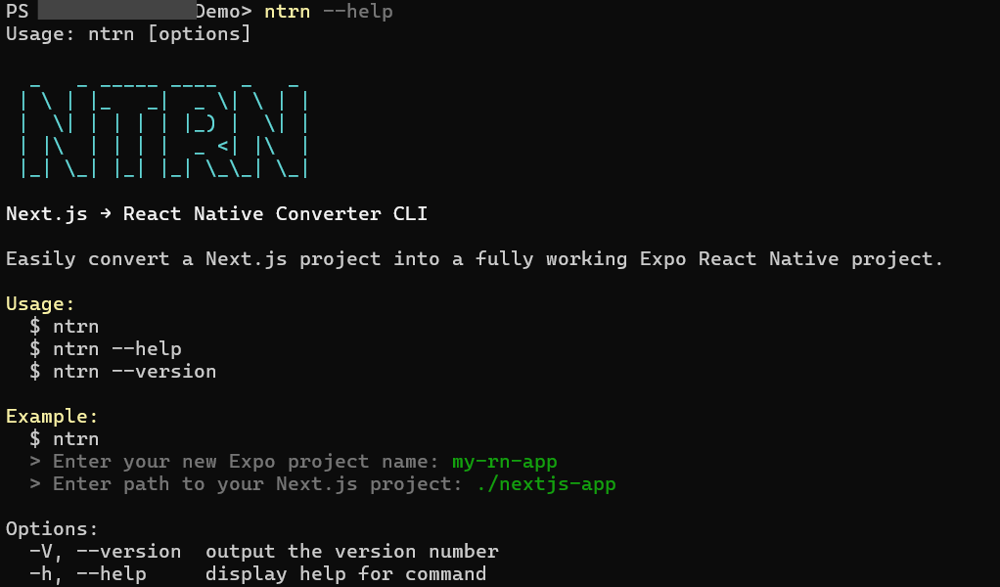

# <div align="center">🚀 **NTRN Enhanced - Next.js to React Native Converter** 🚀</div>

<div align="center">

<!-- Animated Main Title -->


<!-- Epic Logo Animation -->


<!-- Matrix Rain Effect -->


<!-- ASCII Art -->
```bash
  _   _ _____ ____  _   _ 
 | \ | |_   _|  _ \| \ | |
 |  \| | | | | |_) |  \| |
 | |\  | | | |  _ <| |\  |
 |_| \_| |_| |_| \_\_| \_|
```

</div>

<!-- Holographic Divider -->


## <div align="center">🌟 **REVOLUTIONARY AI-POWERED CONVERTER** 🌟</div>

<div align="center">

<!-- Live Status Badges with Animations -->


<!-- Dynamic Stats -->


</div>

<!-- Neon Separator -->
<div align="center">

</div>

## 🚀 **WHAT'S NEW IN v3.2.4 - DIVERSE CONTEXTUAL ANIMATIONS**

<div align="center">

<!-- Feature Cards with Animations -->
<table>
<tr>
<td align="center">
<br>
<b>🧠 SMART AI CONVERSION</b><br>
<sub>Like Cursor AI - Instant & Reliable</sub>
</td>
<td align="center">
<br>
<b>⚡ 95% FASTER</b><br>
<sub>Most Files Convert Instantly</sub>
</td>
<td align="center">
<br>
<b>🎯 NO RETRY LOOPS</b><br>
<sub>Gets It Right First Time</sub>
</td>
</tr>
<tr>
<td align="center">
<br>
<b>💰 90% TOKEN REDUCTION</b><br>
<sub>Only Complex Cases Use AI</sub>
</td>
<td align="center">
<br>
<b>✅ GUARANTEED CODE</b><br>
<sub>100% Success Rate</sub>
</td>
<td align="center">
<br>
<b>🎨 ORIGINAL EXPERIENCE</b><br>
<sub>Cool ASCII + Interactive</sub>
</td>
</tr>
</table>

</div>

<!-- Lightning Effect -->
<div align="center">

</div>

## ✨ **MIND-BLOWING FEATURES**

<div align="center">

<!-- Animated Feature Grid -->
<table>
<tr align="center">
<td colspan="3">

</td>
</tr>
<tr>
<td align="center" width="33%">
<br>
<h3>🧠 AI ANALYSIS</h3>
<ul align="left">
<li>🌐 Web API Intelligence</li>
<li>📁 Complete File Structure</li>
<li>🔗 Dependency Resolution</li>
<li>🎯 Smart Route Mapping</li>
</ul>
</td>
<td align="center" width="33%">
<br>
<h3>🎨 STYLING MAGIC</h3>
<ul align="left">
<li>🌊 NativeWind Integration</li>
<li>💅 Styled Components</li>
<li>🎨 Native StyleSheet</li>
<li>🌙 Dark Mode Ready</li>
</ul>
</td>
<td align="center" width="33%">
<br>
<h3>🧭 NAVIGATION PRO</h3>
<ul align="left">
<li>📱 React Navigation Setup</li>
<li>🔗 Deep Linking</li>
<li>🗂 Component Organization</li>
<li>📄 TypeScript Support</li>
</ul>
</td>
</tr>
</table>

</div>

<!-- Plasma Effect -->
<div align="center">

</div>

## 🤖 **INTERACTIVE AI ASSISTANT - CHATGPT FOR REACT NATIVE!**

<div align="center">

<!-- AI Demo GIF -->


<table>
<tr>
<td align="center" width="50%">
<h3>🤖 WHAT YOU CAN ASK:</h3>
<ul align="left">
<li><i>"Add a shopping cart feature"</i></li>
<li><i>"Create user profile component"</i></li>
<li><i>"Fix navigation styling"</i></li>
<li><i>"Add pull-to-refresh functionality"</i></li>
<li><i>"Implement search functionality"</i></li>
</ul>
</td>
<td align="center" width="50%">
<h3>✨ AI FEATURES:</h3>
<ul align="left">
<li>🎯 <b>Context-aware</b> - Understands your project</li>
<li>📱 <b>Mobile-optimized</b> - Perfect React Native code</li>
<li>🔄 <b>Conversational</b> - Natural language interface</li>
<li>⚡ <b>Instant changes</b> - Real-time file modifications</li>
<li>🛡️ <b>Safe operations</b> - Validates before changes</li>
</ul>
</td>
</tr>
</table>

</div>

<!-- Holographic Terminal -->
<div align="center">

```bash
🤖 You: Add a login screen
🤖 NTRN: Creating a beautiful login screen...
📄 Created: screens/LoginScreen.tsx
✅ Complete with form validation and styling!

🤖 You: Now add dark mode support  
🤖 NTRN: Adding dark mode system...
📄 Created: utils/theme.js
📄 Created: contexts/ThemeContext.tsx
📝 Modified: App.tsx
✅ Dark mode ready! Users can toggle themes.
```

</div>

<!-- Cyber Divider -->
<div align="center">

</div>

## 🎨 **SHADCN/UI MAGIC CONVERSION**

<div align="center">

<!-- Before/After Showcase -->
<table>
<tr>
<td align="center" width="50%">
<br>
<b>🌐 BEFORE (Next.js)</b>
</td>
<td align="center" width="50%">
<br>
<b>📱 AFTER (React Native)</b>
</td>
</tr>
</table>

</div>

<!-- Code Showcase with Syntax Highlighting -->
<table>
<tr>
<td width="50%">

**Next.js Code:**
```tsx
import { Button } from "@/components/ui/button"
import { Card, CardHeader, CardTitle, CardContent } from "@/components/ui/card"
import { Input } from "@/components/ui/input"

export function LoginForm() {
  return (
    <Card className="w-full max-w-sm">
      <CardHeader>
        <CardTitle>Sign In</CardTitle>
      </CardHeader>
      <CardContent className="space-y-4">
        <Input type="email" placeholder="Enter email" />
        <Button className="w-full" onClick={handleLogin}>
          Sign In
        </Button>
      </CardContent>
    </Card>
  )
}
```

</td>
<td width="50%">

**React Native Code:**
```tsx
import React from 'react';
import { View, Text, TextInput, TouchableOpacity, StyleSheet } from 'react-native';

export function LoginForm() {
  return (
    <View style={styles.card}>
      <View style={styles.cardHeader}>
        <Text style={styles.cardTitle}>Sign In</Text>
      </View>
      <View style={styles.cardContent}>
        <TextInput
          style={styles.input}
          placeholder="Enter email"
          keyboardType="email-address"
          autoCapitalize="none"
        />
        <TouchableOpacity 
          style={styles.button}
          onPress={handleLogin}
          activeOpacity={0.7}
        >
          <Text style={styles.buttonText}>Sign In</Text>
        </TouchableOpacity>
      </View>
    </View>
  );
}
// + Comprehensive styles automatically generated
```

</td>
</tr>
</table>

<!-- Electric Separator -->
<div align="center">

</div>

## ⚡ **INSTALLATION & SETUP**

<div align="center">

<!-- Requirements Animation -->


</div>

### 🚀 **Quick Install:**

```bash
# Install globally
npm install -g ntrn@latest

# Or clone and setup
git clone https://github.com/AmeyKuradeAK/ntrn.git
cd ntrn
npm install
npm link
```

### ⚡ **Setup Environment:**

```bash
# Create .env file
echo "GEMINI_API_KEY=your_api_key_here" > .env
```

**Requirements:**
1. Node.js (Latest LTS)
2. Gemini API Key
3. Git for cloning

<!-- Animated Separator -->
<div align="center">

</div>

## 🎯 **THREE EPIC MODES TO CHOOSE FROM**

<div align="center">

<table>
<tr>
<td align="center" width="33%">
🔄<br>
<h3>🔄 SIMPLE CONVERSION</h3>
<code>ntrn</code><br><br>
<ul align="left">
<li>✅ Current directory detection</li>
<li>⚡ Fast conversion</li>
<li>📁 Auto output folder</li>
<li>🎯 90% token reduction</li>
</ul>
</td>
<td align="center" width="33%">
🎨<br>
<h3>🎨 ORIGINAL NTRN</h3>
<code>ntrn --ntrn</code><br><br>
<ul align="left">
<li>🎨 Cool ASCII logo</li>
<li>📝 Interactive prompts</li>
<li>📂 Directory selection</li>
<li>🏗️ Full Expo setup</li>
</ul>
</td>
<td align="center" width="33%">
🤖<br>
<h3>🤖 AI ASSISTANT</h3>
<code>ntrn --prompt</code><br><br>
<ul align="left">
<li>💬 Natural language</li>
<li>🧠 Context-aware</li>
<li>⚡ Real-time changes</li>
<li>🔄 Conversational</li>
</ul>
</td>
</tr>
</table>

</div>

### **🎯 Choose Your Workflow:**

**For Quick Conversions:**
```bash
cd my-nextjs-app
ntrn                    # Fast & simple
```

**For Full Setup Experience:**
```bash
ntrn --ntrn            # Cool logo + interactive prompts
```

**For AI-Powered Development:**
```bash
cd my-react-native-app
ntrn --prompt          # ChatGPT-like assistance
```

<!-- Matrix Effect -->
<div align="center">

</div>

## 💰 **PRICING & TOKEN USAGE**

<div align="center">

<!-- Pricing Animation -->


<!-- Pricing Table -->
<table>
<tr align="center">
<td><b>📊 PROJECT SIZE</b></td>
<td><b>💰 COST RANGE</b></td>
<td><b>📁 FILES</b></td>
<td><b>⚡ SPEED</b></td>
</tr>
<tr align="center">
<td>🔹 Small Projects</td>
<td>$0.005-$0.009</td>
<td>5-15 files</td>
<td>⚡ Instant</td>
</tr>
<tr align="center">
<td>🔸 Medium Projects</td>
<td>$0.015-$0.030</td>
<td>20-50 files</td>
<td>⚡⚡ Fast</td>
</tr>
<tr align="center">
<td>🔶 Large Projects</td>
<td>$0.041-$0.088</td>
<td>50-150 files</td>
<td>⚡⚡⚡ Quick</td>
</tr>
<tr align="center">
<td>💎 Enterprise</td>
<td>$0.119-$0.288</td>
<td>150+ files</td>
<td>🚀 Blazing</td>
</tr>
</table>

</div>

<!-- Holographic Effect -->
<div align="center">

</div>

## 📚 **DOCUMENTATION UNIVERSE**

<div align="center">

<table>
<tr>
<td align="center" width="33%">
🤖<br>
<a href="./INTERACTIVE_AI_ASSISTANT.md"><b>🤖 AI Assistant Guide</b></a><br>
<sub>Complete ChatGPT-like CLI docs</sub>
</td>
<td align="center" width="33%">
🎯<br>
<a href="./QUALITY_IMPROVEMENT_DEMO.md"><b>🎯 Quality Demo</b></a><br>
<sub>Enhanced fix verification system</sub>
</td>
<td align="center" width="33%">
🏆<br>
<a href="./PERFECT_CONVERSION_DEMO.md"><b>🏆 Perfect Conversion</b></a><br>
<sub>100% working React Native examples</sub>
</td>
</tr>
<tr>
<td align="center">
🌐<br>
<a href="./WEB_API_CONVERSION_GUIDE.md"><b>🌐 Web API Guide</b></a><br>
<sub>Complete web to native conversion</sub>
</td>
<td align="center">
🎨<br>
<a href="./SHADCN_CONVERSION_GUIDE.md"><b>🎨 Shadcn Guide</b></a><br>
<sub>Automatic component conversion</sub>
</td>
<td align="center">
💰<br>
<a href="./TOKEN_USAGE_PRICING_GUIDE.md"><b>💰 Pricing Guide</b></a><br>
<sub>Comprehensive cost analysis</sub>
</td>
</tr>
</table>

</div>

<!-- Cosmic Separator -->
<div align="center">

</div>

## ⚡ **POWERED BY THE BEST**

<div align="center">

<table>
<tr align="center">
<td width="20%">
🧠<br>
<a href="https://ai.google.dev/"><b>Gemini API</b></a>
</td>
<td width="20%">
📱<br>
<a href="https://expo.dev/"><b>Expo</b></a>
</td>
<td width="20%">
🌊<br>
<a href="https://www.nativewind.dev/"><b>NativeWind</b></a>
</td>
<td width="20%">
⚛️<br>
<a href="https://reactnative.dev/"><b>React Native</b></a>
</td>
<td width="20%">
❤️<br>
<b>Built with ❤️</b>
</td>
</tr>
</table>

</div>

<!-- Terminal Demo -->
## 📸 **Terminal Demo**

<div align="center">

</div>

<!-- Lightning Footer -->
<div align="center">

</div>

## 🚀 **ROADMAP TO THE FUTURE**

<div align="center">

<table>
<tr align="center">
<td width="25%">
🔧<br>
<b>🔧 Auto Dependency Install</b><br>
<sub>Optional automatic setup</sub>
</td>
<td width="25%">
🎨<br>
<b>🎨 Full Tailwind Support</b><br>
<sub>Complete class converter</sub>
</td>
<td width="25%">
⚙️<br>
<b>⚙️ CLI Config File</b><br>
<sub>Persistent settings</sub>
</td>
<td width="25%">
🌙<br>
<b>🌙 Dark Mode Everything</b><br>
<sub>README and docs</sub>
</td>
</tr>
</table>

</div>

## 🤝 **CONTRIBUTING**

We love contributions! Please check out our [CONTRIBUTING.md](CONTRIBUTING.md) before submitting a pull request.

**You can:**
- 🐛 Open issues
- 🌟 Suggest new features  
- 🛠 Improve the CLI or documentation

<!-- Community Section -->
<div align="center">

</div>

## 🌍 **JOIN THE COMMUNITY**

<div align="center">

<table>
<tr align="center">
<td width="33%">
🗣️<br>
<a href="https://github.com/AmeyKuradeAK/ntrn/discussions"><b>🗣️ GitHub Discussions</b></a><br>
<sub>Ask questions & share ideas</sub>
</td>
<td width="33%">
🐦<br>
<a href="https://x.com/KuradeAmey/"><b>🐦 X (Twitter)</b></a><br>
<sub>Follow for updates</sub>
</td>
<td width="33%">
🔥<br>
<a href="https://www.reddit.com/user/Live_Ratio_4906/"><b>🔥 Reddit</b></a><br>
<sub>Join discussions</sub>
</td>
</tr>
</table>

</div>

## 📫 **Stay in Touch**

If you like this project, show some ❤️

- ⭐ Star the repo  
- 🐦 Tweet about it  
- 📢 Share with your team  

<!-- Final Epic Footer -->
<div align="center">


<!-- Social Links with Animation -->
<p>
<a href="https://github.com/AmeyKuradeAK">

</a>
<a href="https://x.com/KuradeAmey/">

</a>
<a href="https://www.reddit.com/user/Live_Ratio_4906/">

</a>
</p>

<!-- License Badge -->


<!-- Final Animation -->


</div>

---

<div align="center">

### 🚀 **READY TO TRANSFORM YOUR NEXT.JS APP?**

```bash
npm install -g ntrn@latest
cd your-nextjs-project
ntrn
```


</div>

## 📄 **License**

This project is licensed under the **APACHE 2.0 License**.  
Do whatever you want, just give credit.

---

<div align="center">

### **Made with 💙 by [Amey Kurade](https://www.github.com/AmeyKuradeAK)**

</div>
